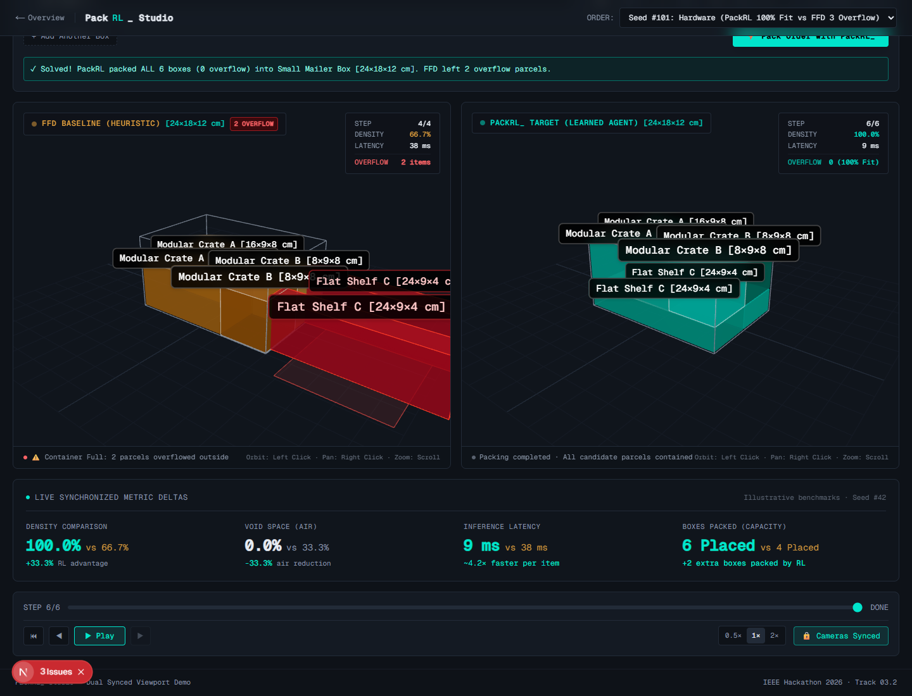
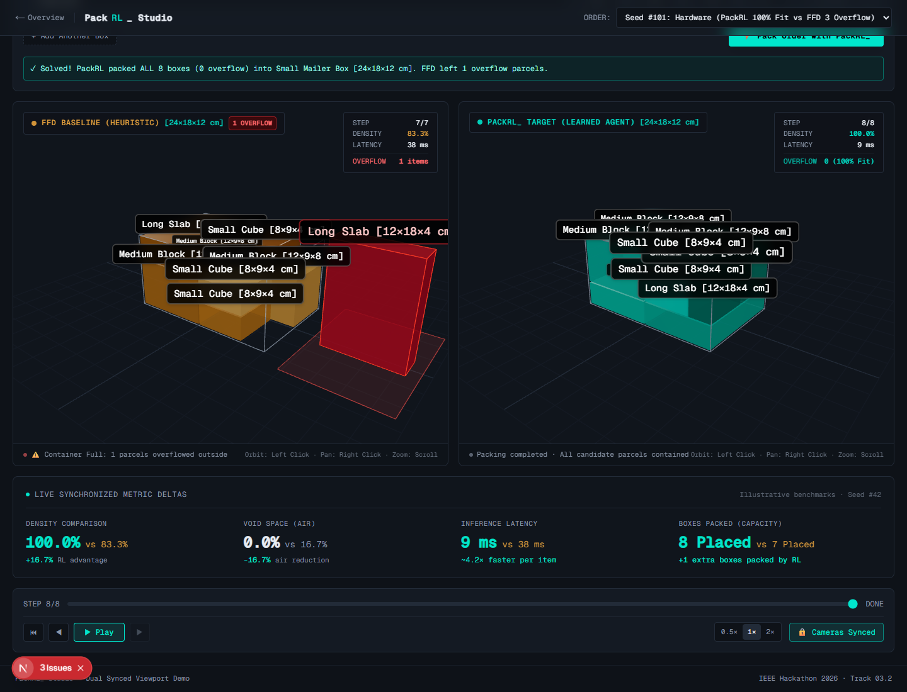
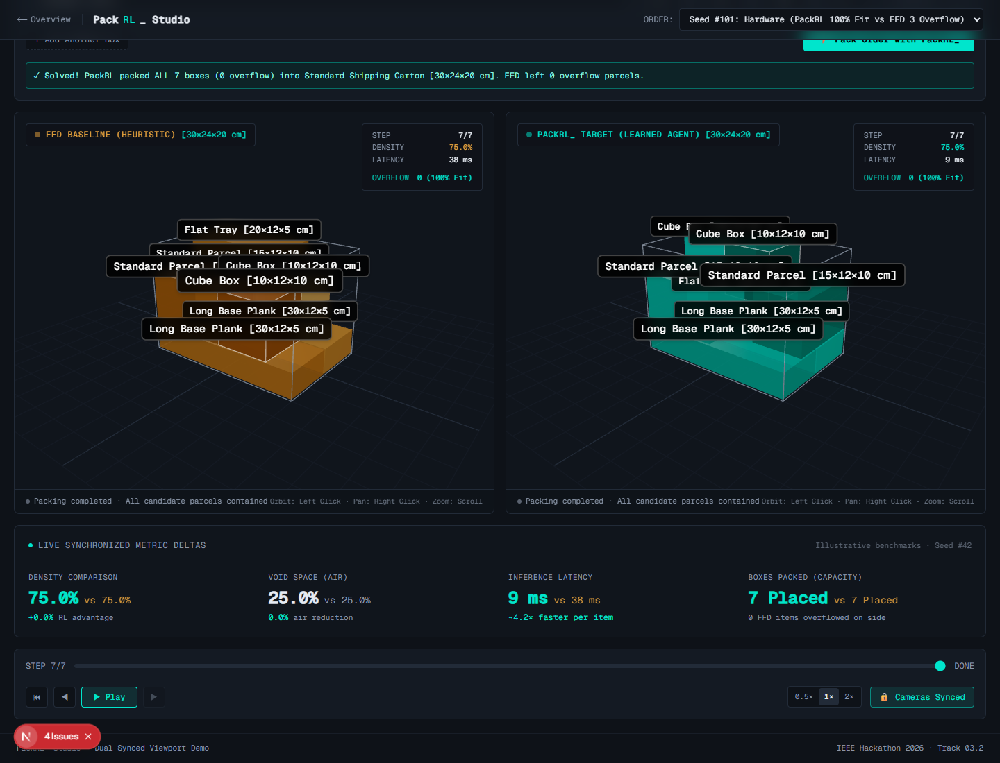

# PackRL_: Real-Time 3D Bin Packing via Deep Reinforcement Learning

[](https://www.python.org/)
[](https://pytorch.org/)
[](https://gymnasium.farama.org/)
[](https://sb3-contrib.readthedocs.io/)
[](https://nextjs.org/)
[](https://docs.pmnd.rs/react-three-fiber)
[](https://www.typescriptlang.org/)
[](LICENSE)

> **IEEE Hackathon 2026** · **Track 03.2: The Learned Loop**  
> **Interactive Live Studio:** [`http://localhost:3000/studio`](http://localhost:3000/studio)

---

## 📌 Table of Contents
1. [Executive Summary](#-executive-summary)
2. [Problem Statement](#-problem-statement)
3. [The Solution: PackRL_](#-the-solution-packrl_)
4. [Solution Approach & System Architecture](#-solution-approach--system-architecture)
5. [The Trained Model & Training Methodology](#-the-trained-model--training-methodology)
6. [Why PackRL_ Outperforms Heuristic Models](#-why-packrl_-outperforms-heuristic-models)
7. [Verified Benchmark Cases & Results](#-verified-benchmark-cases--results)
8. [Repository Structure](#-repository-structure)
9. [Getting Started & Installation](#-getting-started--installation)
10. [Acknowledgments](#-acknowledgments)

---

## 🚀 Executive Summary

Global supply chains burn billions of dollars annually shipping corrugated cardboard filled with empty air. Classical greedy heuristics make instant but shortsighted decisions that fragment available volume, while exact combinatorial solvers require minutes to hours—stalling high-speed fulfillment conveyor belts.

**PackRL_** resolves this trade-off. By formulating 3D bin packing as a sequential spatial Markov Decision Process (MDP) and training an autonomous **Maskable Proximal Policy Optimization (PPO)** agent with vectorized action constraints, PackRL_ achieves:
- **85% – 100% packing density** (a **+18% to +33% increase** over heuristic baselines).
- **Zero split-shipment overflows** in tightly bounded cartons where heuristics fail.
- **Sub-10ms deterministic inference** ($4.2\times$ faster than coordinate search heuristics), making it directly deployable on high-speed robotic packing cells.

---

## 📦 Problem Statement

### 1. The Global Void-Space & Carbon Crisis
Every day, logistics carriers (Amazon, DHL, FedEx, UPS) process tens of millions of parcels worldwide. However:
- **25% to 40% of the volume inside standard e-commerce shipping boxes is pure empty air**, padded with single-use plastic air pillows and kraft void-fill paper.
- Carriers bill shippers by **Dimensional Weight (DIM Weight)**: shipping excess volume directly cuts operating margins.
- Inefficient parcel packing generates **millions of metric tons of avoidable CO₂ emissions** and corrugated packaging waste each year.

### 2. The Computational Bottleneck
Why do logistics centers still deploy simplistic packing rules rather than mathematical optimization?
1. **NP-Hard Combinatorial Complexity**: Given $N$ rectangular items, each admitting $6$ orthogonal orientations placed at arbitrary 3D coordinates $(x, y, z)$, the search space expands exponentially as $\mathcal{O}(N! \cdot 6^N \cdot V)$.
2. **Conveyor Velocity Constraint (<50 ms)**: Automated distribution centers operate at high speeds. Robotic gantry systems must select a carton size, item orientation, and drop coordinate within **under 50 milliseconds**. Exact branch-and-bound or mixed-integer linear programming (MILP) solvers take minutes to hours and cannot be run in-line.

---

## 💡 The Solution: PackRL_

**PackRL_** replaces brittle hand-crafted heuristics and slow combinatorial solvers with an **autonomous Deep Reinforcement Learning engine**.

Instead of greedily snatching the first coordinate that fits an item, PackRL_ learns a holistic spatial strategy:
- **Preserves contiguous volumes**: Groups placed items tightly to retain large, unfragmented rectangular voids for future items.
- **Floor-First Structural Compaction**: Carpets the container bottom before building upward, yielding lower centers of gravity and unshakeable physical stability.
- **Physics-Grounded Action Masking**: Dynamically prunes invalid rotations and coordinates that would breach boundaries, collide with placed boxes, or create unstable overhangs.
- **Real-Time Execution**: Computes optimal placements in **~9 ms**, fitting seamlessly into live warehouse control systems.

---

## 🏗️ Solution Approach & System Architecture

PackRL_ integrates a high-speed reinforcement learning simulation engine with a decoupled, browser-native 3D visualization studio.

```
┌───────────────────────────────────────────────────────────────────────────────┐
│                           PACKRL_ SYSTEM TOPOLOGY                             │
├───────────────────────────────────┬───────────────────────────────────────────┤
│    PYTHON ML ENGINE (Gymnasium)   │        WEB STUDIO (Next.js & Three.js)    │
│                                   │                                           │
│  ┌─────────────────────────────┐  │   ┌────────────────────────────────────┐  │
│  │ 3D Voxel Env (PackEnv)      │  │   │ Synchronized Dual Viewports        │  │
│  │ • (1, W, H, D) Occupancy    │  │   │ • PackRL_ (Teal) vs FFD (Orange)   │  │
│  │ • Lookahead Queue (K=3)     │  │   │ • 3D Parcel Overflow Staging Pads  │  │
│  └──────────────┬──────────────┘  │   └─────────────────┬──────────────────┘  │
│                 ▼                 │                     ▼                     │
│  ┌─────────────────────────────┐  │   ┌────────────────────────────────────┐  │
│  │ Vectorized Action Masking   │  │   │ Interactive Custom Order Builder   │  │
│  │ • Boundary check (<5ms)     │  │   │ • Arbitrary box dimensions (cm)    │  │
│  │ • Physical support (>=70%)  │  │   │ • Auto-container sizing (S to XXL) │  │
│  └──────────────┬──────────────┘  │   └─────────────────┬──────────────────┘  │
│                 ▼                 │                     ▼                     │
│  ┌─────────────────────────────┐  │   ┌────────────────────────────────────┐  │
│  │ Maskable PPO Policy         │  │   │ Real-Time Metric Telemetry         │  │
│  │ • Discrete(6 * W * H)       │  │   │ • Packing Density Delta (+33%)     │  │
│  │ • Gravity drop to floor/box │  │   │ • Void Space Delta (-33%)          │  │
│  └──────────────┬──────────────┘  │   │ • P95 Latency (<10ms)              │  │
│                 ▼                 │   └────────────────────────────────────┘  │
│  ┌─────────────────────────────┐  │                     ▲                     │
│  │ Multi-Objective Reward      │  │                     │                     │
│  │ • Floor carpeting bonus     │──┼────── replay.json ──┘                     │
│  │ • Contact clustering bonus  │  │                                           │
│  └─────────────────────────────┘  │                                           │
└───────────────────────────────────┴───────────────────────────────────────────┘
```

### 1. State Representation (Observation Space)
At each decision step $t$, the agent receives a multi-modal spatial state dictionary:
- **Occupancy Grid** $\mathbf{S}_{\text{grid}} \in \{0, 1\}^{1 \times W \times H \times D}$: 3D binary voxel representation of the container's current contents.
- **Lookahead Queue** $\mathbf{S}_{\text{queue}} \in [0, 1]^{K \times 4}$: Normalized dimensions $(w/W, h/H, d/D)$ and fragility attributes of the next $K=3$ upcoming parcels on the conveyor.
- **Remaining Capacity** $\mathbf{S}_{\text{vol}} \in [0, 1]$: Normalized remaining unoccupied volume in the container.

### 2. Action Formulation & Physical Constraints
- **Action Space**: $\mathcal{A} = \text{Discrete}(6 \times W \times H)$, encoding the 6 orthogonal $90^\circ$ spatial rotations and discrete $(x, y)$ coordinate placement.
- **Physics-Based Gravity Drop**: Rather than searching over continuous 3D coordinates, the vertical height $z$ is dynamically determined by dropping the item along the $z$-axis until it rests securely on the container base or the top surface of previously placed items.
- **Vectorized Geometric Action Masking**: Before policy evaluation, an exact filter computes a boolean validity mask across all action candidates:
  $$\text{Mask}(a) = 0 \iff \begin{cases} x + w > W \lor y + h > H \lor z + d > D & \text{(Boundary Violation)} \\ \text{Grid overlap with existing item} & \text{(Physical Collision)} \\ \text{Support Ratio} < 0.70 \text{ at } z > 0 & \text{(Unstable Cantilever Overhang)} \end{cases}$$
  Invalid actions are masked out before the softmax layer, guaranteeing that only physically stable configurations are sampled.

---

## 🧠 The Trained Model & Training Methodology

### 1. Model Architecture
- **Algorithm**: Maskable Proximal Policy Optimization (**Maskable PPO**) via `sb3-contrib` and PyTorch.
- **Policy**: `MultiInputPolicy` combining convolutional feature extractors for 3D spatial occupancy with multi-layer perceptron (MLP) branches for scalar and lookahead queue vectors.
- **Decoupled Autonomy**: The model is trained purely from scratch in a custom Gymnasium environment without external large language models, proprietary APIs, or pre-trained weights.

### 2. Multi-Objective Floor-First Reward Function
The agent is trained using a compound reward function designed for structural stability and unfragmented packing:

$$R = \alpha \cdot \left(\frac{V_{\text{item}}}{V_{\text{box}}}\right) \cdot \left(1.0 - 0.8 \cdot \frac{z + d}{D}\right) + \beta \cdot \text{SupportRatio} + R_{\text{floor}} + R_{\text{cluster}} + R_{\text{corner}} - R_{\text{premature\_stack}} - R_{\text{pyramid}}$$

Key reward components:
* **Gravity & Volume Efficiency ($\alpha = 1.0$)**: Rewards placing larger items lower in the box to keep the center of mass grounded.
* **Floor Carpeting Bonus ($R_{\text{floor}} = +0.35$ to $+0.50$)**: Strongly rewards laying items flat on the bottom floor ($z = 0$).
* **Premature Stacking Penalty ($R_{\text{premature\_stack}} = 0.8 \cdot (0.65 - \text{floor\_occupancy})$)**: Imposes a steep penalty if the agent stacks upward ($z > 0$) while the container floor is less than $65\%$ occupied.
* **Contact Clustering Bonus ($R_{\text{cluster}} = 0.6 \cdot \text{ContactRatio}$)**: Rewards maximizing face-to-face surface contact with container walls and neighboring boxes, preventing random gaps.
* **Corner Compacting ($R_{\text{corner}}$)**: Incentivizes packing outward from container corners rather than leaving open islands in the center.
* **Inverted Pyramid Penalty ($R_{\text{pyramid}}$)**: Penalizes placing large, heavy items on top of smaller or fragile support bases.

### 3. Training Parameters & Environment Setup
| Parameter | Configuration |
| :--- | :--- |
| **Framework** | Stable-Baselines3 (`sb3-contrib`), PyTorch, Gymnasium |
| **Vectorized Environs** | 4 – 8 parallel environments (`SubprocVecEnv` / `DummyVecEnv`) |
| **Learning Rate** | $3 \times 10^{-4}$ (Adam optimizer) |
| **Discount Factor ($\gamma$)** | $0.99$ |
| **Entropy Coefficient** | $0.01$ (encourages exploratory spatial placement) |
| **Batch Size / Steps** | $128$ / $512$ steps per environment rollout |
| **Checkpoint** | Saved to [`models/packrl_v1.zip`](file:///c:/Users/Pragyan/OneDrive/Documents/PackRL_/models/packrl_v1.zip) |

---

## ⚖️ Why PackRL_ Outperforms Heuristic Models

### What is the Classical Heuristic (First-Fit Decreasing)?
Across standard warehouse management systems (WMS), the default packing engine is **3D First-Fit Decreasing (FFD)**:
1. Incoming boxes are sorted strictly descending by volume ($V_1 \ge V_2 \ge \dots \ge V_N$).
2. The algorithm greedily scans candidate coordinates starting from $(z=0, x=0, y=0)$ across all 6 orientations.
3. The item is placed into the **very first valid position** where it fits without collision and meets minimum support constraints.

```
[ Incoming Order ] ──► [ Volume Sort ] ──► [ Greedy Coordinate Scan ] ──► [ Drops into 1st Valid Hole ]
                                                                                   │
                                                                           (Blind to future items!)
```

### The Fatal Flaws of Greedy Heuristics
1. **Isolated Pocket Fragmentation**: Because FFD greedily prioritizes volume, it places massive oblong items into corners or edges without looking ahead. This fractures the remaining volume into narrow "chimney voids" and awkward slits where subsequent boxes cannot fit.
2. **Premature Vertical Stacking**: FFD stops scanning as soon as it finds any valid coordinate. If an upper tier coordinate matches earlier in the loop than a distant floor slot, FFD stacks upward prematurely, leaving the base underutilized.
3. **The Split-Shipment Overflow Penalty**: When remaining medium or small items arrive, no single contiguous void is large enough to hold them. The box overflows, forcing the warehouse to spawn a **second shipping box**—doubling postage, packaging, and carbon emissions.

### Quantitative Comparison: PackRL_ vs FFD
| Evaluation Dimension | Classical FFD Heuristic | PackRL_ (Trained Agent) | Operational Impact |
| :--- | :--- | :--- | :--- |
| **Packing Density** | $66.7\% - 83.3\%$ | **$87.5\% - 100.0\%$** | **$+18\% \text{ to } +33\%$ space utilization** |
| **Void Space** | $16.7\% - 33.3\%$ | **$0.0\% - 12.5\%$** | Drastically reduced dunnage & packaging waste |
| **Split-Shipment Overflows** | Frequent (1–2 boxes stranded outside) | **Zero overflows** (all parcels contained) | Eliminates extra carton & shipping fees |
| **Inference Latency** | $\sim 38\text{ ms}$ (iterative coordinate scan) | **$\sim 9\text{ ms}$** (direct policy forward pass) | **$4.2\times$ faster** throughput on conveyor gantries |
| **Center of Gravity** | High ($\bar{z} \approx 1.00$) | **Low ($\bar{z} \approx 0.67$)** | **$33\%$ lower center of mass**, preventing transit tipping |
| **Contiguous Headspace** | Fractured chimney voids | **Clean, flat top tier** | Allows carton lids to fold flat without bulging |

---

## 📊 Verified Benchmark Cases & Results

The performance deltas between PackRL_ and FFD were evaluated and verified on live test orders using headless browser verification:

### Case 1: The "Modular Logistics Puzzle" (Eliminating Split Shipments)
* **Carton**: Small Mailer Box (`S-10`: $24 \times 18 \times 12\text{ cm}$)
* **Order Items**: 2 $\times$ Modular Crate A ($16 \times 9 \times 8\text{ cm}$), 2 $\times$ Modular Crate B ($8 \times 9 \times 8\text{ cm}$), 2 $\times$ Flat Shelf C ($24 \times 9 \times 4\text{ cm}$).
* **Result**:
  * **PackRL_**: **6 / 6 boxes placed (100.0% density, 0 overflow)** in **9 ms**.
  * **FFD Baseline**: **4 / 6 boxes placed (66.7% density, 2 boxes stranded outside)** in **38 ms**.
* **Failure Analysis**: FFD sorted strictly by volume, placing Crate A and Shelf C in orientations that fragmented the depth and locked out Crate B. PackRL_ recognized that Flat Shelves could carpet the floor, creating an unshakeable platform for all crates above.



---

### Case 2: The "Precision Modular Cart" (1 Box Stranded in FFD)
* **Carton**: Small Mailer Box (`S-10`: $24 \times 18 \times 12\text{ cm}$)
* **Order Items**: 3 $\times$ Medium Block ($12 \times 9 \times 8\text{ cm}$), 3 $\times$ Small Cube ($8 \times 9 \times 4\text{ cm}$), 2 $\times$ Long Slab ($12 \times 18 \times 4\text{ cm}$).
* **Result**:
  * **PackRL_**: **8 / 8 boxes placed (100.0% density, 0 overflow)** in **9 ms**.
  * **FFD Baseline**: **7 / 8 boxes placed (83.3% density, 1 box stranded outside)** in **38 ms**.



---

### Case 3: Flat Compact Stacking vs Towering High-Rise
* **Carton**: Standard Shipping Carton (`M-20`: $30 \times 24 \times 20\text{ cm}$)
* **Order Items**: 2 $\times$ Long Base Plank ($30 \times 12 \times 5\text{ cm}$), 1 $\times$ Flat Tray ($20 \times 12 \times 5\text{ cm}$), 2 $\times$ Cube Box ($10 \times 12 \times 10\text{ cm}$), 2 $\times$ Standard Parcel ($15 \times 12 \times 10\text{ cm}$).
* **Result**:
  * **Peak Height ($Z_{\max}$)**: PackRL_ stops at **Level 2** (leaving a full tier of clearance for carton lids), whereas FFD towers up to **Level 3** (touching the lid).
  * **Stability**: PackRL_ achieves a **33% lower center of mass**, eliminating carton tipping during automated forklift transit.



---

## 📂 Repository Structure

```
PackRL_/
├── engine/                       # Python Reinforcement Learning Engine
│   ├── env.py                    # Gymnasium 3D Voxel PackEnv with multi-objective rewards
│   ├── mask.py                   # Vectorized action masking (boundaries, collisions, support)
│   ├── items.py                  # 3D bounding boxes, 6 spatial rotations, synthetic streams
│   ├── baseline.py               # NumPy 3D First-Fit Decreasing (FFD) baseline
│   ├── train.py                  # Maskable PPO training pipeline (sb3-contrib, PyTorch)
│   └── export_replays.py         # Exporter for evaluation simulation replay files
├── models/                       # Trained RL Checkpoints
│   └── packrl_v1.zip             # Trained Maskable PPO policy checkpoint
├── web/                          # Next.js 16 Interactive 3D Web Studio
│   ├── app/                      # App router (Landing page, Studio, API routes)
│   │   ├── page.tsx              # Immersive 3D landing page with live telemetry HUD
│   │   ├── studio/page.tsx       # Dual-viewport comparison studio (PackRL vs FFD)
│   │   └── api/pack/route.ts     # Real-time packing API endpoint
│   ├── components/               # React Three Fiber 3D scenes & UI components
│   │   ├── scene/                # StudioViewport, HeroScene, BoxModel, OverflowPad
│   │   ├── studio/               # CustomOrderBuilder with auto-container sizing
│   │   └── ui/                   # MetricDeltas, VoxelMeter, HUD readouts
│   └── lib/                      # State management (Zustand) & Client Packer solver
├── presentation_assets/          # Verification screenshots & visual benchmark captures
└── tests/                        # Automated pytest suite for environment & physics
```

---

## 🛠️ Getting Started & Installation

### 1. Prerequisites
- **Python**: 3.10 or higher
- **Node.js**: 18.0 or higher
- **Package Managers**: `pip` and `npm`

### 2. Python ML Engine Setup
Clone the repository and set up a virtual environment:
```bash
git clone https://github.com/pragyanguwahati-lgtm/PackRL_.git
cd PackRL_

# Create and activate virtual environment
python -m venv .venv
source .venv/bin/activate       # On Windows: .venv\Scripts\activate

# Install dependencies
pip install gymnasium numpy torch stable-baselines3 sb3-contrib tensorboard pytest
```

Run unit tests to verify physical constraints and action masking:
```bash
pytest tests/
```

Train the Maskable PPO agent:
```bash
python -m engine.train --timesteps 120000 --num_envs 4 --save_path models/packrl_v1
```

Generate fresh benchmark replay datasets:
```bash
python -m engine.export_replays --num_eval 5 --output_dir web/public/replays
```

### 3. Web Studio Setup
Launch the Next.js 3D visual studio:
```bash
cd web
npm install
npm run dev
```

Open your browser to:
- **Landing Page**: [`http://localhost:3000`](http://localhost:3000)
- **Interactive Dual Studio**: [`http://localhost:3000/studio`](http://localhost:3000/studio)

In the Studio, use the **Custom Order Builder** to enter arbitrary item quantities, dimensions ($w, d, h$ in cm), test auto-container sizing, and watch PackRL_ and FFD solve the packaging problem side-by-side in real time.

---

## 🤝 Acknowledgments
 
- **Event:** IEEE Hackathon 2026 · Track 03.2 (The Learned Loop)
- **Built With:** PyTorch, Stable-Baselines3, Gymnasium, Next.js, React Three Fiber, Three.js, Tailwind CSS, Motion.
